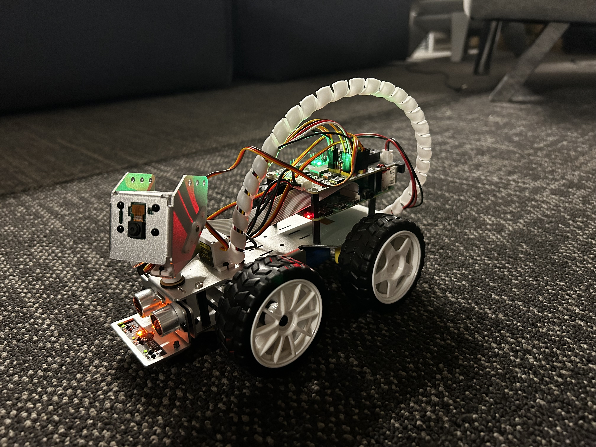

# Autonomous Picar-X with Person Tracking & Advertising

### HackIllinois 2025 | John Deere Track  

  

## Overview  
We built an **autonomous vehicle** using a **Picar-X (SunFounder)** with **Raspberry Pi**. Over **36 hours** at **HackIllinois 2025 (UIUC)**, our team developed a program that finds customers and delivers advertisements to them. 

## How It Works  
1. The camera scans the vicinity for a person using a **pose detection** algorithm (which is based on MediaPipe by Google)
2. If a person is found, the car **moves toward them** and **tracks them** dynamically, adjusting its path in real-time  
3. Stops in front of person using **ultrasonic sensors** 
4. Plays a **John Deere advertisement** (Hackathon track sponsors), followed by **a text-to-speech advertisement in three languages**

## Hardware/Software Used  
- **Picar-X (SunFounder)**  
- **Camera Module (Vilib/Pose Detection)** (for person detection)  
- **Ultrasonic Sensors** (for stopping)  
- **Built-in Speaker (Robot Hat)** (for advertisements)  
- **Raspberry Pi 4 Model B**

## Team  
[@Ishaan2602](https://github.com/Ishaan2602), [@BergamotAndSeaweed](https://github.com/BergamotAndSeaweed), @[@RoshanBalla](https://github.com/RoshanBalla), William

## Setup & Run  
Clone the repo and run the main script:  
```bash
git clone https://github.com/Ishaan2602/hackillinois-2025.git
cd hackillinois-2025
python automated-advert-transmit.py 